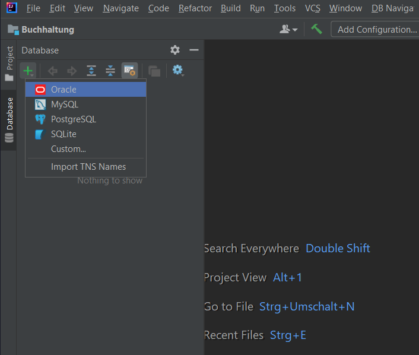

# Buchhaltungs-App mit Java & MySQL

## Informationen

- **Name:** Teodor Stanculeasa
- **Fach:** ITL_12
- **Auftrag:** 9. Aufgabenstellung: Buchhaltung
- **Datum:** 08.04.2025

## Projektbeschreibung

Die Anwendung erm�glicht es, Einnahmen in eine MySQL-Datenbank zu speichern und �ber eine grafische Oberfl�che (Swing GUI) anzuzeigen. Es wurde mit IntelliJ entwickelt und nutzt JDBC f�r die Datenbankverbindung.

## Verwendete Technologien

- Java (Swing GUI)
- JDBC Connector
- MySQL / XAMPP
- IntelliJ IDEA

## Setup

### 1. XAMPP starten
Der MySQL-Server wurde �ber XAMPP gestartet:


### 2. Tabellenstruktur (SQL)
Die Tabelle `Einnahmen` wurde mit folgendem SQL-Code erstellt:
```sql
CREATE TABLE Einnahmen (
    id INT AUTO_INCREMENT PRIMARY KEY,
    betrag DOUBLE NOT NULL,
    kategorie VARCHAR(50),
    datum DATE,
    beschreibung TEXT
);
```


### 3. Neue Datenbank erstellen
Die Datenbank `HaushaltsApp` wurde verbunden:


### 4. Verbindung testen
Die Verbindung wurde erfolgreich aufgebaut mit JDBC:


### 5. Java Connector einbinden
- JAR-Datei im Projekt als Bibliothek hinzugef�gt

## GUI & Funktionen

### Benutzeroberfl�che
Die grafische Oberfl�che wurde mit Swing erstellt. Sie erlaubt das Eintragen von Einnahmen mit Betrag, Datum, Kategorie und Beschreibung.


### Datenspeicherung
Eintr�ge werden per JDBC in die Datenbank geschrieben. Pflichtfelder sind Betrag und Datum.

### Datenanzeige
Beim Klicken auf "Anzeigen" wird ein neues Fenster mit allen gespeicherten Daten ge�ffnet:


## Projektstruktur

- **Java Code:** `\Buchhaltung\src\BuchhaltungUI.java`
- **JDBC Connector:** Im Hauptverzeichnis eingebunden
- **Bilder:** `images/` Ordner im Projektverzeichnis

## Fazit

Die Anwendung demonstriert erfolgreich eine einfache Java-Datenbankverbindung mit Benutzeroberfl�che. Erweiterungen wie Ausgabenverwaltung, Diagramme oder CSV-Export sind einfach umsetzbar.
